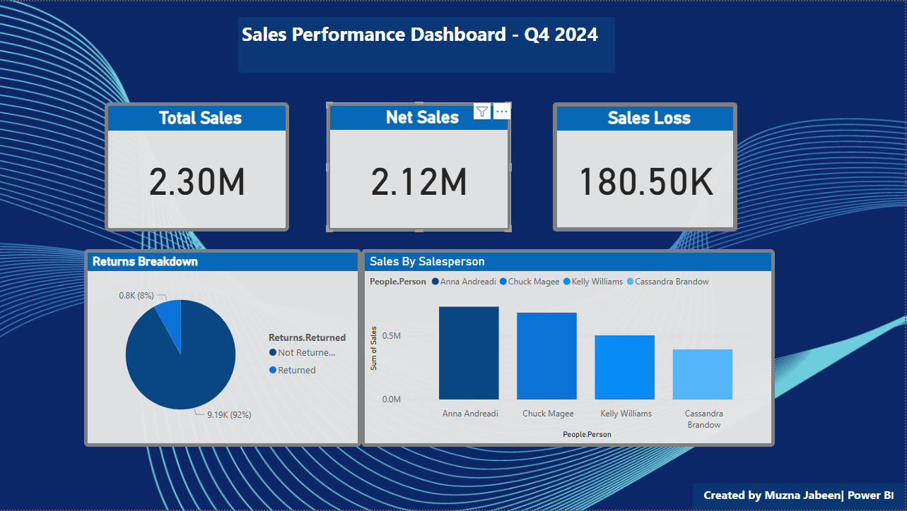

# Muzna-Data-Portfolio
Welcome!
I’m a business-driven Data Analyst skilled in Power BI, SQL, and Excel, currently pivoting from 8+ years of business and client-facing roles into the world of data.
I specialize in turning raw data into clean, actionable insights that help businesses make better decisions faster.

## Project Overview

This Sales Performance Dashboard was built using Power BI to analyze Q4 2024 sales data.

Key features:
- KPI cards showing Total Sales, Net Sales, and Sales Loss
- Returns breakdown by percentage
- Sales performance by salesperson
- Clean branded theme and layout designed for executive presentation
- Skills used: Power Query, DAX, Data Modeling, Visualization Design
