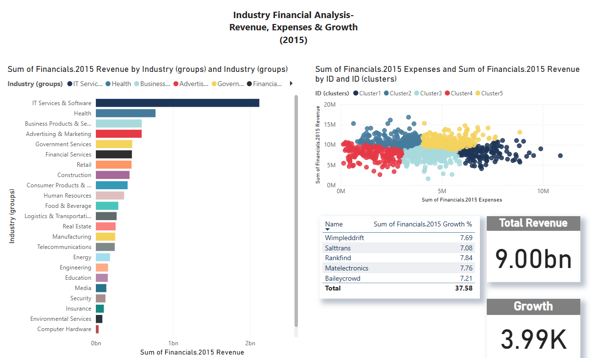

# Muzna-Data-Portfolio
Welcome!
Hi, I'm Muzna Jabeen — a business-driven aspiring Data Analyst transitioning from 8+ years of experience in client-focused sales roles into the world of analytics.

I recently completed a Business Intelligence bootcamp and built multiple Power BI dashboards using SQL, DAX, Power Query, and clean data modeling techniques.

I specialize in turning raw data into clear, visual stories that help businesses make better decisions faster.

Tools: Power BI, SQL, Excel, DAX, Power Query
Focus Areas: Dashboard Design, Data Cleaning, Business Insights, Executive Reporting

Currently open to remote or hybrid opportunities in Data Analyst or Business Intelligence Analyst roles.

## Project Overview

This Sales Performance Dashboard was built using Power BI to analyze Q4 2024 sales data.

Key features:
- KPI cards showing Total Sales, Net Sales, and Sales Loss
- Returns breakdown by percentage
- Sales performance by salesperson
- Clean branded theme and layout designed for executive presentation
- Skills used: Power Query, DAX, Data Modeling, Visualization Design

  

 

## Project Overview

Industry Financial Analysis (Revenue, Expenses & Growth – 2015)

**Tools Used:** Power BI, Power Query, DAX

This dashboard explores industry-level financial data across multiple sectors using 2015 revenue, expenses, and growth rates. The goal was to uncover high-performing clusters and identify industries with strong financial positioning.

### Key Features:
- Total revenue breakdown by industry group (bar chart)
- Customer cluster segmentation based on revenue vs. expense patterns (scatter plot)
- KPI cards for total revenue and average growth
- Clean layout and branded theme

## Contact

📧 Email: [muznaj81@gmail.com](mailto:muznaj81@gmail.com)  
🔗 LinkedIn: [linkedin.com/in/muzna-j](https://linkedin.com/in/muzna-j)
